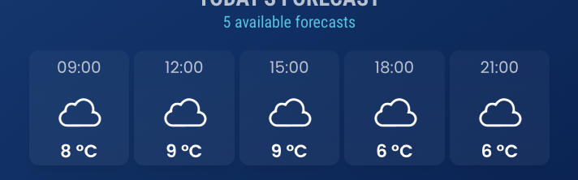
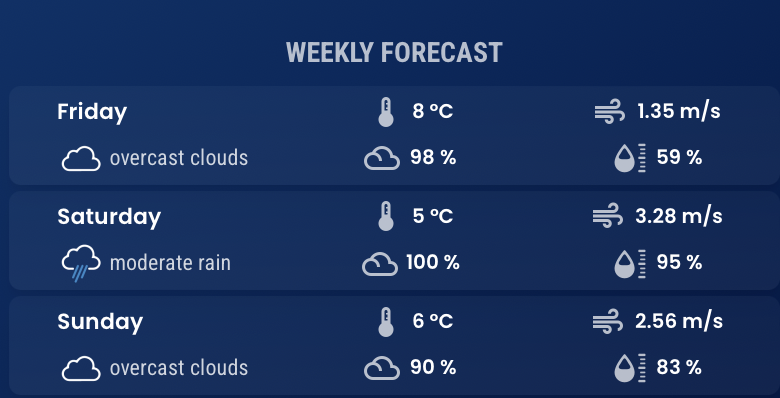
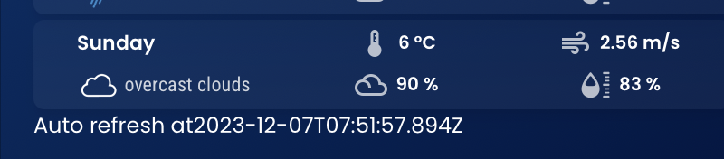

## React Weather App

Create a weather application that provides detailed weather information for Singapore.

### Requirement
 
Functionalities:
* [x] Include a search field for the user to enter location.
* [x] Display hourly weather forecast for the current day

* [x] Allows the option to show X-day (e.g. 5-day) weather forecast
- chose: 0: khong hien thi 
- 
- 
* [x] Have a responsive design and auto re-fresh periodically to get updated data
- 
* [x] Use a weather API of choice (such as open weather map) to fetch the weather data for the location
* [x] If needed, use a geo-location API to get coordinates for the location
* [x] Design the UI as a widget-based dashboard.
* [x] Allows adding widget by entering the city name, the widget will show the details of current weather and forecast weather for 1-7 days of that city.
* [x] Allows deletion of widgets.

* [x] Allows drag to change the position of the widget on the screen.

Thank You ☺
